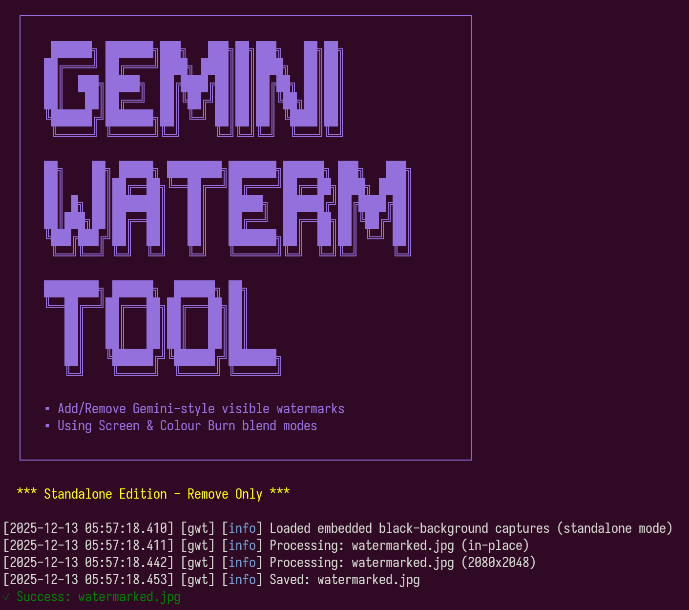

{height=80 fig-align="center"}

## Intro

GeminiWatermarkTool 是一个用于移除 Gemini 图片右下角可见水印的开源工具。它的核心不是生成式修补，而是针对水印叠加方式做 reverse alpha blending，尽量把原始像素还原回来。

## My Use

我会把它放在“AI 图片素材清理”的工具位：先处理可见 Gemini 水印，再用 ImageMagick、pngquant 或设计工具做尺寸、格式和压缩收尾。它适合批量处理明确带有 Gemini 可见水印的图片，不适合当作通用修图工具。

## When to Use / Not Use

**适合**

- 去除 Gemini 图片右下角的可见水印
- 批量处理 Gemini 生成图
- 保留文字、截图、图表这类不适合生成式重绘的细节
- 需要 GUI 或 CLI 两种使用方式
- 想在脚本或 agent workflow 里自动化处理图片

**不适合**

- 移除 SynthID 这类不可见水印
- 处理非 Gemini 水印或自定义水印
- 需要法律/版权合规保证的商业发布流程
- 原图已经严重压缩、缩放或二次编辑的情况
- 希望用 AI 重新绘制缺失区域的场景

## Gotchas

- 它只针对可见 Gemini 水印，不移除 SynthID invisible watermark
- 简单拖拽模式可能原地覆盖文件，处理前先备份
- 检测阈值会影响是否跳过无水印图片，批量处理时尤其要注意
- 对已经缩放、重压缩或后期处理过的图片，可能残留痕迹
- 移除水印可能涉及版权、署名或平台规则，使用前要确认用途合规

## My Setup

```bash
# 下载 release 后，给二进制执行权限（Linux/macOS）
chmod +x GeminiWatermarkTool

# 单张图片，显式指定输出文件
GeminiWatermarkTool -i watermarked.jpg -o clean.jpg

# 批量处理目录
GeminiWatermarkTool -i ./watermarked_images/ -o ./clean_images/

# 检测失败时强制处理
GeminiWatermarkTool --force image.jpg
```

## Story

这个工具有意思的地方在于，它不是把水印区域“脑补”掉，而是反过来计算水印叠加前的像素。对文字、幻灯片、UI 截图、图表这类素材来说，这比生成式 inpainting 更稳，因为模型很容易把字形、边缘和细线改坏。它解决的是一个很具体的问题：Gemini 可见水印。

## Minimal Example

```bash
# 保留原图，输出 clean.jpg
GeminiWatermarkTool -i watermarked.jpg -o clean.jpg

# 简单模式，直接处理单个文件
GeminiWatermarkTool watermarked.jpg

# 批量处理文件夹
GeminiWatermarkTool -i input-dir -o output-dir
```

## References

- [GitHub](https://github.com/allenk/GeminiWatermarkTool)
- [Releases](https://github.com/allenk/GeminiWatermarkTool/releases)
- [SynthID Research Report](https://github.com/allenk/GeminiWatermarkTool/blob/main/report/synthid_research.md)
